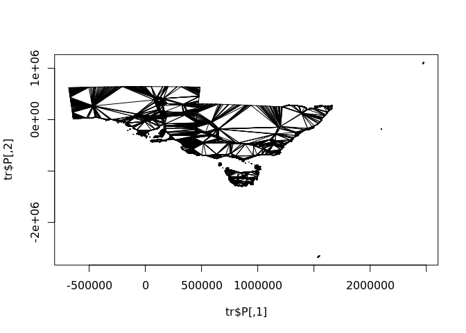

[](https://travis-ci.org/hypertidy/laridae)
[](https://ci.appveyor.com/project/hypertidy/laridae)

<!-- README.md is generated from README.Rmd. Please edit that file -->

`laridae` came out of a need for constrained triangulation for a
topology-in-R project. That effort has moved on somewhat, proving the
case by using `RTriangle` and then bedding down the normalization model
in the `hypertidy/silicate` package.

RTriangle is really fast, but it’s not as fast as CGAL. CGAL can also be
used to update a triangulation, which means (I think) that we could
build an unconstrained triangulation from all the coordinates, and then
add in any segments, even unclosed linear paths. At any rate, being able
to update a mesh has a lot of applications, especially for neighbouring
shapes, and for on-demand (extent or zoom dependent level of detail)
tasks.

The interest in constrained triangulations is discussed here along with
the overall landscape in R.

<https://github.com/r-spatial/discuss/issues/6>

## Installation

Dev-only for now

### Linux

Ubuntu/Debian

``` bash
apt install libcgal-dev
apt install libcgal-demo
apt install cmake g++
```

## Other OS …

## And then

Make sure to run this when your defs change, also when the system has
been updated
?

``` r
tools::package_native_routine_registration_skeleton("../laridae", "src/init.c",character_only = FALSE)
```

WIP

## Triangulation

Triangulate with CGAL via
[laridae](https://github.com/hypertidy/laridae). The function `tri_xy`
performs an exact Delaunay triangulation on all vertices, returning a
triplet-index for each triangle (zero-based in CGAL).

Some timings, to show we aren’t wildly off-base and that CGAL wins for
raw unconstrained Delaunay triangulation.

``` r
#x    <- c(2.3,3.0,7.0,1.0,3.0,8.0)
#y    <- c(2.3,3.0,2.0,5.0,8.0,9.0)

set.seed(90)
x <- rnorm(1e3, sd = 4)
y <- rnorm(1e3, sd = 2)
#x <- c(0, 0, 1, 1)
#y <- c(0, 1, 1, 0)
library(laridae)

# plot a matrix xy as points
# and add the triangulation indexed
# by structural triplet row-identifiers
poly_index <- function(xy, index, ...) {
  plot(xy, ...)
  ## assume index is 0,1,2,0,1,2,0,1,...
  ii <- c(rbind(matrix(index, nrow = 3), NA_integer_))
  ## have forgetten why polypath fails, so just use polygon
  polygon(xy[ii, 1], xy[ii, 2])
}


library(dplyr)
#> 
#> Attaching package: 'dplyr'
#> The following objects are masked from 'package:stats':
#> 
#>     filter, lag
#> The following objects are masked from 'package:base':
#> 
#>     intersect, setdiff, setequal, union
library(tibble)

xy <- cbind(x, y)
system.time({
  ind_t <- tri_xy(xy[,1], xy[,2]) + 1
})
#>    user  system elapsed 
#>   0.002   0.000   0.001
system.time({
  ind_t1 <- tri_xy1(xy[,1], xy[,2]) + 1
})
#>    user  system elapsed 
#>   0.002   0.000   0.002
system.time({
  ind_t2 <- tri_xy2(xy[,1], xy[,2]) + 1
})
#>    user  system elapsed 
#>   0.001   0.000   0.001

length(ind_t)
#> [1] 5961
length(ind_t1)
#> [1] 5961
length(ind_t2)
#> [1] 5961


ps <- RTriangle::pslg(P = xy)
system.time({
  ind_T <- c(t(RTriangle::triangulate(ps)$T))
})
#>    user  system elapsed 
#>   0.002   0.000   0.003
length(ind_T)
#> [1] 5961

p <- par(mfrow = c(2, 2), mar = rep(0, 4))
poly_index(xy, ind_t, pch = ".")
## can't work as order is not aligned, but still fun
poly_index(xy, ind_t1, pch = ".")  
poly_index(xy, ind_t2, pch = ".")
poly_index(xy, ind_T, pch = ".")
```

<!-- -->

``` r
par(p)


## other comparisons
library(deldir)
#> deldir 0.1-25
system.time(dl <- deldir::deldir(x, y))
#> 
#>      PLEASE NOTE:  The components "delsgs" and "summary" of the
#>  object returned by deldir() are now DATA FRAMES rather than
#>  matrices (as they were prior to release 0.0-18).
#>  See help("deldir").
#>  
#>      PLEASE NOTE: The process that deldir() uses for determining
#>  duplicated points has changed from that used in version
#>  0.0-9 of this package (and previously). See help("deldir").
#>    user  system elapsed 
#>   0.057   0.000   0.057
plot(dl)
```

<!-- -->

``` r
library(geometry)
system.time(gm <- geometry::delaunayn(xy))
#>    user  system elapsed 
#>   0.008   0.000   0.042
poly_index(xy, c(t(gm)))

## sf comparison
library(dplyr)
library(sf)
#> Linking to GEOS 3.8.0, GDAL 3.0.2, PROJ 6.2.1
```

<!-- -->

``` r
d <- st_as_sf(tibble::as_tibble(xy) %>% mutate(a = row_number()), coords = c("x", "y"))
## timing is unfair as sf must be decomposed and recomposed
## and every triangle has four coordinates, no sharing allowed
## and probably sfdct is slow ..
library(sfdct)
## this doesn't do anything, same as rgl::triangulate must
## have edge inputs
##system.time(sfd <- st_triangulate(d))
system.time(dt <- ct_triangulate(d))
#> all POINT, returning one feature triangulated
#>    user  system elapsed 
#>   0.151   0.020   0.172
plot(dt, col = "transparent", border = "black")
```

<!-- -->

## Constrained triangulation

There are various ways to do this WIP

``` r
sc <- silicate::SC(silicate::inlandwaters)
#data("wrld_simpl", package = "maptools")
#sc <- silicate::SC(wrld_simpl)
X <- sc$vertex$x_
Y <- sc$vertex$y_
i0 <- match(sc$edge$.vx0, sc$vertex$vertex_)
i1 <- match(sc$edge$.vx1, sc$vertex$vertex_)


system.time(laridae:::insert_mesh(X, Y, i0 - 1, i1 -1))
#> Number of vertices before: 30835
#> Number of vertices after: 31079
#>    user  system elapsed 
#>   0.638   0.000   0.637


## compare RTriangle
system.time({
  ps <- RTriangle::pslg(cbind(X, Y), S = cbind(i0, i1))
  tr <- RTriangle::triangulate(ps, D = TRUE)
})
#>    user  system elapsed 
#>   0.212   0.004   0.215

plot(tr$P, pch= ".")
segments(tr$P[tr$E[,1],1], tr$P[tr$E[,1],2], 
         tr$P[tr$E[,2],1], tr$P[tr$E[,2],2])
```

<!-- -->

``` r

str(tr)
#> List of 12
#>  $ P : num [1:31778, 1:2] -681074 -680885 -680821 -680474 -680376 ...
#>  $ PB: int [1:31778, 1] 1 1 1 1 1 1 1 1 1 1 ...
#>  $ PA: num[1:31778, 0 ] 
#>  $ T : int [1:43051, 1:3] 4455 4455 4510 4542 4510 4410 4376 4380 4397 4390 ...
#>  $ S : int [1:31786, 1:2] 24305 24316 24328 24328 24326 24321 24343 24354 24349 24349 ...
#>  $ SB: int [1:31786, 1] 0 0 0 0 0 0 0 0 0 0 ...
#>  $ E : int [1:74679, 1:2] 4455 4456 4492 4492 4542 4510 4492 4542 4562 4492 ...
#>  $ EB: int [1:74679, 1] 1 1 0 0 0 1 0 1 0 1 ...
#>  $ VP: num [1:43051, 1:2] 51155 52903 52733 54473 52163 ...
#>  $ VE: int [1:74679, 1:2] 1 1 1 2 2 3 3 4 4 5 ...
#>  $ VN: num [1:43051, 1:2] -2148 -124 0 0 0 ...
#>  $ VA: num[1:43051, 0 ] 
#>  - attr(*, "class")= chr "triangulation"
```

## History

Was originally called `cgalgris`.

## Code of Conduct

Please note that the laridae project is released with a [Contributor
Code of
Conduct](https://contributor-covenant.org/version/1/0/0/CODE_OF_CONDUCT.html).
By contributing to this project, you agree to abide by its terms.
