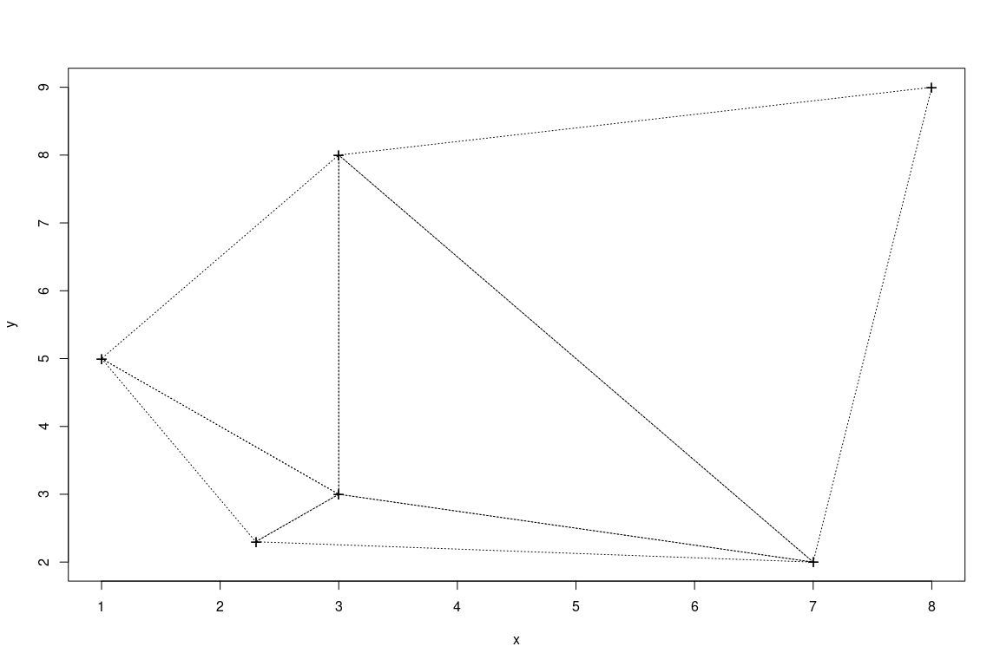
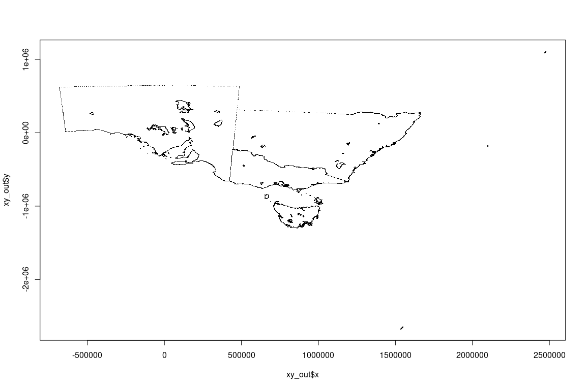

<!-- badges: start -->

[](https://github.com/hypertidy/laridae/actions)
<!-- badges: end -->

<!-- README.md is generated from README.Rmd. Please edit that file -->

`laridae` came out of a need for constrained triangulation for a
topology-in-R project. That effort has moved on somewhat, proving the
case by using `RTriangle` and then bedding down the normalization model
in the `hypertidy/silicate` package.

RTriangle is really fast, but it’s not as fast as CGAL. CGAL can also be
used to update a triangulation, which means (I think) that we could
build an unconstrained triangulation from all the coordinates, and then
add in any segments, even unclosed linear paths. At any rate, being able
to update a mesh has a lot of applications, especially for neighbouring
shapes, and for on-demand (extent or zoom dependent level of detail)
tasks.

The interest in constrained triangulations is discussed here along with
the overall landscape in R.

<https://github.com/r-spatial/discuss/issues/6>

## Installation

## Triangulation

Triangulate with CGAL via
[laridae](https://github.com/hypertidy/laridae). The function `tri_xy`
performs an exact Delaunay triangulation on all vertices, returning a
triplet-index for each triangle (zero-based in CGAL).

The variants `tri_xy1()` and `tri_xy2()` work slightly differently
illustrating CGAL usage in C++ (thanks to Mark Padgham). ‘xy1’ order is
not trivial … but we ignore that for now.

``` r
library(laridae)
x <- c(0, 0, 1)
y <- c(0, 1, 1)
plot(x, y, pch = "+")
(idx0 <- tri_xy(x, y))
#> [1] 3 2 1
(idx1 <- tri_xy1(x, y))
#> [1] 2 3 1
(idx2 <- tri_xy2(x, y))
#> [1] 3 2 1

polygon(cbind(x, y)[idx0, ])
```


``` r
x    <- c(2.3,3.0,7.0,1.0,3.0,8.0)
y    <- c(2.3,3.0,2.0,5.0,8.0,9.0)
idx <- tri_xy(x, y)
plot(x, y, pch = "+", cex = 1.5)
polygon(cbind(x, y)[rbind(matrix(idx, 3L), NA), ], lty = 3)
```



Some timings, to show we aren’t wildly off-base and that CGAL wins for
raw unconstrained Delaunay triangulation.

``` r
set.seed(90)
x <- rnorm(1e3, sd = 4)
y <- rnorm(1e3, sd = 2)
library(laridae)

# plot a matrix xy as points
# and add the triangulation indexed
# by structural triplet row-identifiers
poly_index <- function(xy, index, ...) {
  plot(xy, ...)
  ## assume index is 0,1,2,0,1,2,0,1,...
  ii <- c(rbind(matrix(index, nrow = 3), NA_integer_))
  ## have forgetten why polypath fails, so just use polygon
  polygon(xy[ii, 1], xy[ii, 2])
}


ps <- RTriangle::pslg(P = cbind(x, y))

microbenchmark::microbenchmark(
  ind_t <- tri_xy(x, y), 
  ind_t1 <- tri_xy1(x, y), 
  ind_t2 <- tri_xy2(x, y), 
  RT <- RTriangle::triangulate(ps)
)
#> Unit: microseconds
#>                              expr      min       lq     mean   median       uq
#>             ind_t <- tri_xy(x, y)  975.482 1144.680 1181.812 1202.424 1249.999
#>           ind_t1 <- tri_xy1(x, y)  955.613 1128.420 1175.676 1195.845 1234.148
#>           ind_t2 <- tri_xy2(x, y)  968.282 1173.378 1196.648 1203.808 1242.891
#>  RT <- RTriangle::triangulate(ps) 1586.462 1883.151 1999.267 2022.814 2110.343
#>       max neval cld
#>  1377.836   100  a 
#>  1348.109   100  a 
#>  1358.163   100  a 
#>  2433.358   100   b
length(ind_t)
#> [1] 5961
length(ind_t1)
#> [1] 5961
length(ind_t2)
#> [1] 5961
length(RT$T)
#> [1] 5961


p <- par(mfrow = c(2, 2), mar = rep(0, 4))
poly_index(cbind(x, y), ind_t, pch = ".")
## can't work as order is not aligned, but still fun
poly_index(cbind(x, y), ind_t1, pch = ".")  
poly_index(cbind(x, y), ind_t2, pch = ".")
plot(RT)
```


``` r
par(p)
```

## Constrained triangulation

Currently laridae only has “reporting” of the result. I can’t yet see
how to

-   get the vertex pool (it may have expanded given mesh properties,
    overlapping segments, etc.)
-   get the triangle index

The only other implementation in R is in RTriangle, so we use that for
comparison.

``` r
sfx <- silicate::inlandwaters
sc <- silicate::SC(sfx)
X <- sc$vertex$x_
Y <- sc$vertex$y_
i0 <- match(sc$edge$.vx0, sc$vertex$vertex_)
i1 <- match(sc$edge$.vx1, sc$vertex$vertex_)

system.time(insert_constraint(X, Y, i0 , i1))
#> Number of vertices before: 30835
#> Number of vertices after: 31079
#>    user  system elapsed 
#>   0.365   0.000   0.364
system.time(segment_constraint(sc))
#> The number of resulting constrained edges is: 30843
#>    user  system elapsed 
#>   0.392   0.000   0.391

system.time(insert_mesh(X, Y, i0 , i1))
#> Number of vertices before: 30835
#> Number of vertices after: 31079
#>    user  system elapsed 
#>   0.075   0.000   0.075

## compare RTriangle, it's fast if we don't include pslg() time
ps <- RTriangle::pslg(cbind(X, Y), S = cbind(i0, i1))
system.time({
  tr <- RTriangle::triangulate(ps, D = TRUE)
})
#>    user  system elapsed 
#>   0.075   0.000   0.075


plot(tr$P, pch= ".")
segments(tr$P[tr$E[,1],1], tr$P[tr$E[,1],2], 
         tr$P[tr$E[,2],1], tr$P[tr$E[,2],2])
```



``` r
str(tr)
#> List of 12
#>  $ P : num [1:31778, 1:2] -681074 -680885 -680821 -680474 -680376 ...
#>  $ PB: int [1:31778, 1] 1 1 1 1 1 1 1 1 1 1 ...
#>  $ PA: num[1:31778, 0 ] 
#>  $ T : int [1:43051, 1:3] 4455 4455 4510 4542 4510 4410 4376 4380 4397 4390 ...
#>  $ S : int [1:31786, 1:2] 24305 24316 24328 24328 24326 24321 24343 24354 24349 24349 ...
#>  $ SB: int [1:31786, 1] 0 0 0 0 0 0 0 0 0 0 ...
#>  $ E : int [1:74679, 1:2] 4455 4456 4492 4492 4542 4510 4492 4542 4562 4492 ...
#>  $ EB: int [1:74679, 1] 1 1 0 0 0 1 0 1 0 1 ...
#>  $ VP: num [1:43051, 1:2] 51155 52903 52733 54473 52163 ...
#>  $ VE: int [1:74679, 1:2] 1 1 1 2 2 3 3 4 4 5 ...
#>  $ VN: num [1:43051, 1:2] -2148 -124 0 0 0 ...
#>  $ VA: num[1:43051, 0 ] 
#>  - attr(*, "class")= chr "triangulation"
```

## History

Was originally called `cgalgris`.

## Code of Conduct

Please note that the laridae project is released with a [Contributor
Code of
Conduct](https://contributor-covenant.org/version/1/0/0/CODE_OF_CONDUCT.html).
By contributing to this project, you agree to abide by its terms.
